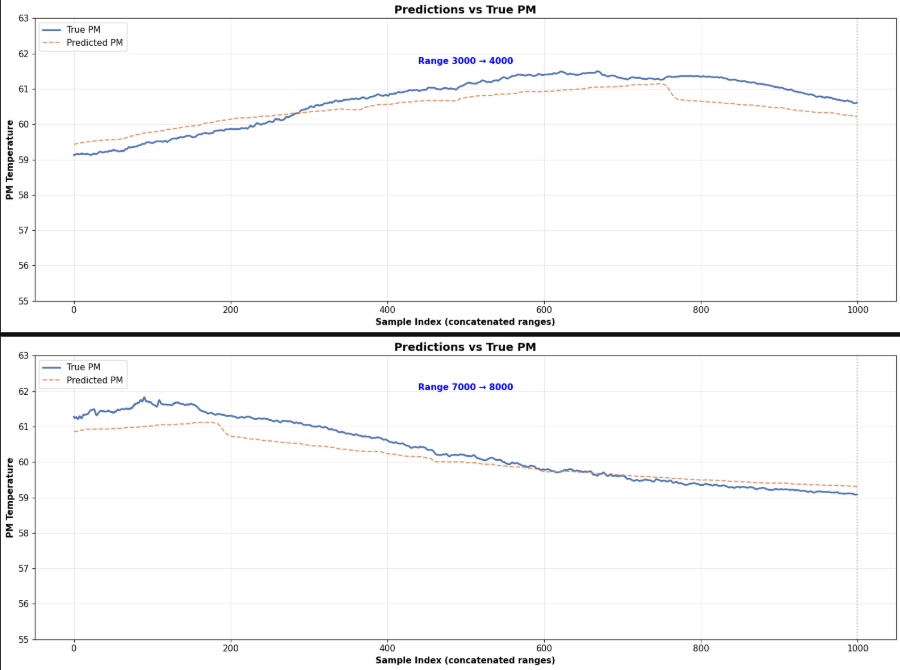
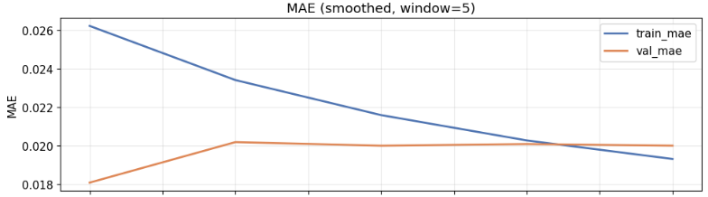

## 📊 Results Preview


*Predicted vs Actual Permanent Magnet Temperature (Test Set)*


*Prediction Error Distribution*

---

## Project Overview

This project focuses on **long-horizon forecasting of permanent magnet (PM) temperature** in electric motors using a **Long Short-Term Memory (LSTM)** neural network.

The objective is to predict future thermal behavior from historical **electrical, mechanical, and thermal measurements**, enabling improved **thermal safety, efficiency, and predictive control** in electric drive systems.

**Author:** Muhammad Ben Hamad  
**Date:** 2025-12-23  
**Framework:** TensorFlow / Keras  

### Problem Definition

Predict the **PM temperature** at a **future horizon of 80 timesteps (≈ 40 seconds)** using a **lookback window of 120 timesteps (≈ 60 seconds)**.

This is formulated as a **direct forecasting task**, where the model outputs a **single temperature prediction at the target horizon**, without recursive or multi-step rollout.

### Deployment Target

New Energy Vehicle (NEV) motor temperature monitoring, thermal fault prevention, and predictive thermal control.

---

## Dataset

This project uses the **Electric Motor Temperature Dataset** from Kaggle:

https://www.kaggle.com/datasets/wkirgsn/electric-motor-temperature

The dataset contains synchronized multivariate time-series measurements collected from a **Permanent Magnet Synchronous Motor (PMSM)** operating under diverse load, speed, and thermal conditions.

### How to Use the Dataset

1. Download `measures_v2.csv` from Kaggle.
2. Place it in the same directory as the notebook:

```text
pm_lstm_forecast.ipynb
measures_v2.csv
```

## Kaggle Notebook

An interactive Kaggle implementation of this project is available at the link below.  

It reproduces the **80 s lookback → 70 s forecast horizon** setup using the **ResNet–LSTM** architecture and includes full training, evaluation, and visualization of results.

**Kaggle Notebook:**  
https://www.kaggle.com/code/muhammadbenhamad/electric-motor-pm-temperature-forecast-resnet-lstm

The Kaggle version provides:
- End-to-end data preprocessing and sequence construction
- ResNet–LSTM model definition and training
- Quantitative evaluation (MAE, RMSE, R²)
- Visual comparison of predicted vs. true PM temperature over multiple operating ranges

 
